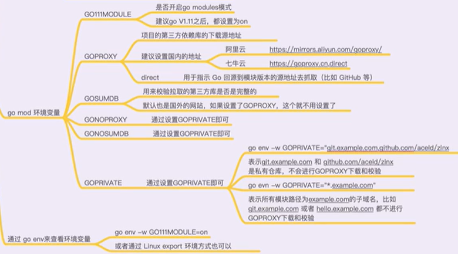
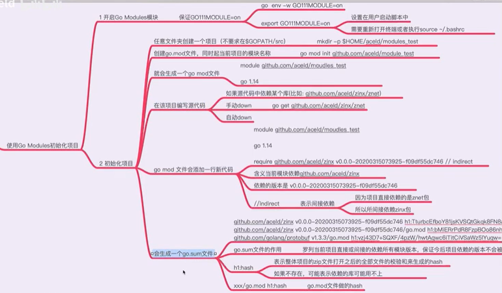

# Golang 入门
> 用了一个周末，把B站上[8小时转职Golang工程师(如果你想低成本学习Go语言)](https://www.bilibili.com/video/BV1gf4y1r79E?p=1)这门课听完了，跟着刘老师手撸了一遍代码，有些语法虽然还不是很懂，但是整个课程还是很适合Java开发在短时间内入门Go

## 环境变量
在撸代码的过程中，在环境变量这块耽误了一些时间

```
# 这里刘老师讲的非常细致，把direct也讲清楚了
go env -w GOPROXY=https://mirrors.aliyun.com/goproxy/
go env -w GO111MODULE=on
GOPATH 开发者go的项目默认路径
GOROOT 源码包所在路径
GOSUMDB 文件校验地址，如果设置了 GOPROXY ，这里就不用设置了
GONOPROXY 设置成 GOPRIVATE 即可
GONOSUMDB 设置成 GOPRIVATE 即可
GOPRIVATE 私仓地址
```

## gomod
上个月被 import 的问题困扰过，听完今天的课，也就知道如何使用了。

